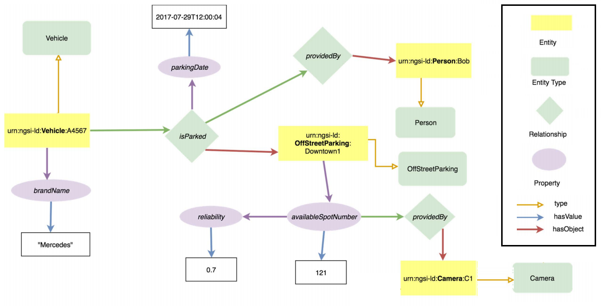

## Smart parking sample  
As use case, we consider a context information management system related to transport. The entity types used in the example are: Vehicle, offStreetParking, Person, and Camera. The figure below illustrates the entities instances and their related properties and relationshiphis.  [source](https://www.etsi.org/deliver/etsi_gs/CIM/001_099/009/01.01.01_60/gs_CIM009v010101p.pdf)

<p align="center">

Property graph
</p>

## Contents 
* [Install REST Client](#InstallRESTClient)
* [Authentication](#authentication)
* [Entities registration](#entitiesRegistration)
* [Entities creation](#entitiesCreation)
* [Retrieve entities](#getEntities)
* [Update entity](#put)
* [Subscribe to entities](#subscribe)

<a name="InstallRESTClient"></a>
## Install REST Client 
* For this section, you need a REST client to send HTTP request *(GET, POST, UPDATE, DELETE)* to the djaneio broker.
* Install Postman extension on google chrome browser: http://www.getpostman.com

<a name="authentication"></a>
## Authentication
Authentication mechanism based on jwt. The authentication endpoint is *localhost:3000/login*. 
To retrieve a JSON Web Token from a default user (admin/admin4djane), valid for an hour by default, run the following query: 
```bash 
curl -d '{"username":"admin", "password":"admin4djane"}' -H 'Content-Type: application/json' -X POST "http://localhost:3000/login"
```
The user credentials are configured in config file (/config/config.js). 

<a name="entitiesRegistration"></a>
## Entities registration 
The following HTTP request creates a csourceRegistration resource which describes which context information a context source provides. In this tutorial, the context source registers that it can provide the following information: 
* brandName property and isParked relationship for a vehicle, 
* availableSpotNumber property for a offStreetParking. 

**HTTP Request**

    POST /ngsi-ld/v1/csourceRegistrations/ HTTP/1.1
    Host: localhost:3000
    Content-Type: application/ld+json
    Content-Length: 1805
    Accept: application/ld+json

    {
        "id": "urn:ngsi-ld:ContextSourceRegistration:csr1a3456",
        "type": "ContextSourceRegistration",
        "information": [
            {
                "entities": [
                    {
                        "id": "urn:ngsi-ld:Vehicle:A4567",
                        "type": "Vehicle"
                    }
                ],
                "properties": [
                    "brandName"
                ],
                "relationships": [
                    "isParked"
                ]
            },
            {
                "entities": [
                    {
                        "idPattern": ".*downtown$",
                        "type": "OffStreetParking"
                    }
                ],
                "properties": [
                    "availableSpotNumber",
                ],
            }
        ],
        "endpoint": "http://my.csource.org:3002",
        "location": {
            "type": "Polygon",
            "coordinates": [
            [
                [
                100.0,
                0.0
                ],
                [
                101.0,
                0.0
                ],
                [
                101.0,
                1.0
                ],
                [
                100.0,
                1.0
                ],
                [
                100.0,
                0.0
                ]
            ]
            ]
        },
        "timestamp": [{
            "start": "2018-11-22T14:53:15Z"
        }],
        "@context": [
            "http://uri.etsi.org/ngsi-ld/v1/ngsi-ld-core-context.jsonld",
            "http://example.org/ngsi-ld/commonTerms.jsonld",
            "http://example.org/ngsi-ld/vehicle.jsonld",
            "http://example.org/ngsi-ld/parking.jsonld"
        ]
    }

**HTTP Response**

If the creation was successful, the response with HTTP return code *201 Created* is returned.

    HTTP/1.1 201 Created
    location: /ngsi-ld/v1/csourceRegistrations/urn:ngsi-ld:ContextSourceRegistration:csr1a3456
    Content-Type : application/ld+json;charset=UTF-8
    ...

    "ContextSourceRegistration:csr1a3456"


<a name="entitiesCreation"></a>
## Entities creation 

### Create Vehicle entity
The following HTTP request creates a vehicle entity with the id *urn:ngsi-ld:Vehicle:A4567* of type Vehicle, the brandName property and the isParked relationship.

**HTTP Request**

    POST /ngsi-ld/v1/entities/ HTTP/1.1
    Host: localhost:3000
    Content-Type: application/ld+json
    Content-Length: 683
    Accept: application/ld+json

    {
        "id": "urn:ngsi-ld:Vehicle:A4567",
        "type": "Vehicle",
        "brandName": {
            "type": "Property",
            "value": "Mercedes"
        },
        "isParked": {
            "type": "Relationship",
            "object": "urn:ngsi-ld:OffStreetParking:Downtown1",
            "observedAt": "2018-12-29T12:00:04Z",
            "providedBy": {
                "type": "Relationship",
                "object": "urn:ngsi-ld:Person:Bob"
            }
        },
        "@context": [
            "http://uri.etsi.org/ngsi-ld/v1/ngsi-ld-core-context.jsonld",
            "http://example.org/ngsi-ld/commonTerms.jsonld",
            "http://example.org/ngsi-ld/vehicle.jsonld",
            "http://example.org/ngsi-ld/parking.jsonld"
        ]
    }

**HTTP Response**

If the creation was successful, the response with HTTP return code *201 Created* is returned.

    HTTP/1.1 201 Created
    location: /ngsi-ld/v1/entities/urn:ngsi-ld:Vehicle:A4567
    Content-Type : application/ld+json;charset=UTF-8
    ...


### Create OffStreetParking entity 

The following HTTP request creates a offStreetParking entity with the id *urn:ngsi-ld:OffStreetParking:Downtown1* of type OffStreetParking and the availableSpotNumber property.

**HTTP Request** 

    POST /ngsi-ld/v1/entities/ HTTP/1.1
    Host: localhost:3000
    Content-Type: application/ld+json
    Content-Length: 751
    Accept: application/ld+json

    {
        "id": "urn:ngsi-ld:OffStreetParking:Downtown1",
        "type": "OffStreetParking",
        "name": {
            "type": "Property",
            "value": "Downtown One"
        },
        "availableSpotNumber": {
            "type": "Property",
            "value": 121,
            "observedAt": "2018-12-29T12:05:02Z",
            "reliability": {
                "type": "Property",
                "value": 0.7
            },
            "providedBy": {
                "type": "Relationship",
                "object": "urn:ngsi-ld:Camera:C1"
            }
        },
        "@context": [
            "http://uri.etsi.org/ngsi-ld/v1/ngsi-ld-core-context.jsonld",
            "http://example.org/ngsi-ld/parking.jsonld"
        ]
    }

**HTTP Response**

If the creation was successful, the response with HTTP return code *201 Created* is returned.

    HTTP/1.1 201 Created
    location: /ngsi-ld/v1/entities/urn:ngsi-ld:OffStreetParking:Downtown1
    Content-Type : application/ld+json;charset=UTF-8
    ...


### Create Person entity

**HTTP Request**

    POST /ngsi-ld/v1/entities/ HTTP/1.1
    Host: localhost:3000
    Content-Type: application/ld+json
    Content-Length: 511
    Accept: application/ld+json

    {
        "id": "urn:ngsi-ld:Person:Bob", 
        "type" : "Person",
        "firstName": {
            "type": "Property", 
            "value": "Bob"
        }, 
        "lastName": {
            "type": "Property", 
            "value" : "Doe"
        }, 
        "age": {
            "type" : "Property", 
            "value" : 22
        }
        "@context": [
            "http://uri.etsi.org/ngsi-ld/v1/ngsi-ld-core-context.jsonld",
            "https://example.com/person.schema.json",
        ]
    }

**HTTP Response**

If the creation was successful, the response with HTTP return code *201 Created* is returned.

    HTTP/1.1 201 Created
    location: /ngsi-ld/v1/entities/urn:ngsi-ld:Person:Bob
    Content-Type : application/ld+json;charset=UTF-8
    ...


<a name="getEntities"></a>
## Retrieve entities 

### Querying entities

This example queries all NGSI-LD entities of type OffStreetParking including all available properties and relationships.

**HTTP Request**

    GET /ngsi-ld/v1/entities?type=OffStreetParking
    Host: localhost:3000
    Accept: application/json+ld

**HTTP Response**

    HTTP/1.1 200 OK
    Content-Type: application/json

    [
        {
            "id": "urn:ngsi-ld:OffStreetParking:Downtown1",
            "type": "OffStreetParking",
            "name": {
                "type": "Property",
                "value": "Downtown One"
            },
            "availableSpotNumber": {
                "type": "Property",
                "value": 121,
                "observedAt": "2018-12-29T12:05:02Z",
                "reliability": {
                    "type": "Property",
                    "value": 0.7
                },
                "providedBy": {
                    "type": "Relationship",
                    "object": "urn:ngsi-ld:Camera:C1"
                }
            },
            "@context": [
                "http://uri.etsi.org/ngsi-ld/v1/ngsi-ld-core-context.jsonld",
                "http://example.org/ngsi-ld/parking.jsonld"
            ]
        }
    ]


### Retrieve a specific entity

To get the Vehicle entity with id *urn:ngsi-ld:Vehicle:A4567*, execute the following request. 

**HTTP Request**

    GET /ngsi-ld/v1/entities/urn:ngsi-ld:Vehicle:A4567
    Host: localhost:3000
    Accept: application/json+ld

**HTTP Response**

    HTTP/1.1 200 OK
    Content-Type: application/json+ld

    {
        "id": "urn:ngsi-ld:Vehicle:A4567",
        "type": "Vehicle",
        "brandName": {
            "type": "Property",
            "value": "Mercedes"
        },
        "isParked": {
            "type": "Relationship",
            "object": "urn:ngsi-ld:OffStreetParking:Downtown1",
            "observedAt": "2018-12-29T12:00:04Z",
            "providedBy": {
                "type": "Relationship",
                "object": "urn:ngsi-ld:Person:Bob"
            }
        },
        "@context": [
            "http://uri.etsi.org/ngsi-ld/v1/ngsi-ld-core-context.jsonld",
            "http://example.org/ngsi-ld/commonTerms.jsonld",
            "http://example.org/ngsi-ld/vehicle.jsonld",
            "http://example.org/ngsi-ld/parking.jsonld"
        ]
    }


<a name="put"></a>
## Update entity

This example shows how to append a new attribute (*speed* property) to an existig Vehicle entity (with id *urn:ngsi-ld:Vehicle:A4567*). 

**HTTP Request**

    POST /ngsi-ld/v1/entities/urn:ngsi-ld:Vehicle:A4567/attrs HTTP/1.1
    Host: localhost:3000
    Content-Type: application/ld+json
    Content-Length: 198

    {
        "speed": {
            "type": "Property",
            "value": 89,
            "accuracy": {
                "type": "Property",
                "value": 0.9
            }
        }
    }

**HTTP Response**

    HTTP/1.1 204 No Content


<a name="subscribe"></a>
## Subscribe to entities

* A context subscriber can create a subscription to receive context updates within an NGSI-LD system as shown in the request below. 
* Send a HTTP request with the following parameters to create a "Subscription" resource for receive asynchronously events from Vehicle entities. Every time the speed (*watchedAttributes*) value is superior to 50 (*q*) of a concerned vehicle,
changes, a new notification (including the new speed value) will be transmitted to the specified endpoint.

**HTTP Request**

    POST /ngsi-ld/v1/subscriptions HTTP/1.1
    Host: localhost:3000
    Content-Type: application/ld+json
    Content-Length: 664

    {
        "id": "urn:ngsi-ld:Subscription:mySubscription",
        "type": "Subscription",
        "entities": [
            {
            "type": "Vehicle"
            }
        ],
        "watchedAttributes": ["speed"],
        "q": "speed>50",
        "notification": {
            "attributes": ["speed"],
            "format": "keyValues",
            "endpoint": {
                "uri": "http://127.0.0.1:1400/notify",
                "accept": "application/json"
            }
        },
        "@context": [
            "http://uri.etsi.org/ngsi-ld/v1/ngsi-ld-core-context.jsonld", 
            "http://example.org/ngsi-ld/vehicle.jsonld"
        ]
    }

**HTTP Response**

    HTTP/1.1 201 Created
    location: /ngsi-ld/v1/subscriptions/urn:ngsi-ld:Subscription:mySubscription
    Content-Type : application/ld+json;charset=UTF-8
    ...

* Update a Vehicle entity representation with speed value superior to 50. Execute the follwing request. 

**HTTP Request**

    PATCH http://127.0.0.1:3000/ngsi-ld/v1/entities/urn:ngsi-ld:Vehicle:A4567/attrs/speed
    Host: localhost:3000
    Content-Type: application/ld+json
    Content-Length: 241

    {
        "id": "urn:ngsi-ld:Vehicle:A4567",
        "speed": {
            "type": "Property",
            "value": 72,
            "accuracy": {
                "type": "Property",
                "value": 0.9
            }
        }
    }

**HTTP Response**

    HTTP/1.1 204 No Content

Here is an example of the Notification representation.

    {
        "id": "urn:ngsi-ld:Notification:notifiction123",
        "type": "Notification",
        "notifiedAt": "2018-12-29T14:05:02Z",
        "data" : [
            {
                    "id": "urn:ngsi-ld:Vehicle:A4567",
                    "speed": {
                        "type": "Property",
                        "value": 72,
                        "accuracy": {
                            "type": "Property",
                            "value": 0.9
                        }
                    }
            }
        ]
    }
